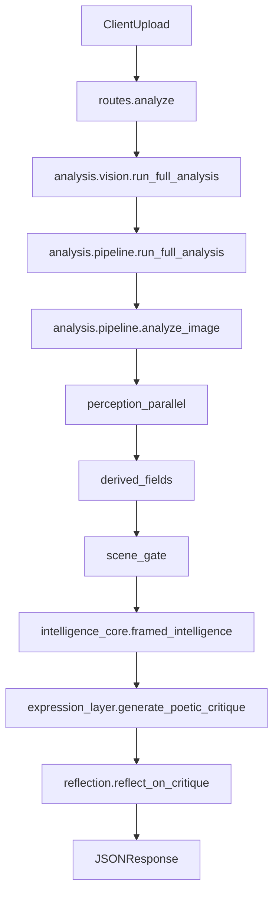

## FRAMED dossier (repo-wide overview)

This file consolidates what FRAMED is today (as implemented), how it’s structured, how it’s meant to run, and what needs runtime verification.

Scope notes:
- This is based on **repo inspection**. Items marked **Needs runtime verification** cannot be proven from static reading alone.
- Your Phase D rule (“human/un‑AI” for comments/docs/user-facing strings; do not edit prompt literals unless opted in) was followed during the refactor; this dossier may *describe* prompt-bearing modules but does not rewrite prompts.

---

## What FRAMED is

FRAMED is a Flask app that accepts an image upload and returns:
- a **canonical analysis schema** (deterministic perception + derived fields + optional intelligence),
- an optional **critique** (Model B expression) with optional **reflection** (self-validation),
- and a UI-focused sanitized view of the canonical schema.

Primary entrypoints:
- `run.py`: WSGI entry (`gunicorn run:app`)
- `framed/__init__.py`: Flask application factory (`create_app`)
- `framed/routes.py`: HTTP endpoints (upload/analyze/reset/ask-echo)
- `framed/analysis/vision.py`: compatibility facade re-exporting analysis entrypoints

---

## High-level runtime flow

Mermaid diagram of the “happy path” for `/analyze`:

Key invariants:
- **No learning inside the LLM**: learning/memory lives in Python (`temporal_memory`, `learning_system`).
- **Cold-start safety**: `/health` should not trigger model weight loads or OpenAI client initialization.
- **Caches must be writable** (HF Spaces: `/data/framed`).

---

## Canonical analysis schema

Canonical schema creation/validation:
- `framed/analysis/schema.py`: `create_empty_analysis_result`, `validate_schema`, normalization utilities.

Pipeline output is expected to include top-level keys such as:
- `metadata` (photo_id, filename, file_hash, timestamp)
- `perception` (technical, semantics, composition, lighting, color, etc.)
- `derived` (genre, emotional_mood, visual_interpretation)
- `visual_evidence` (surface/material/organic signals + scene gate)
- `intelligence` (if enabled; Model A layers/orchestrator output)
- `errors` (non-fatal failures stored by stage)

---

## Modules and responsibilities (map)

### Web layer
- `framed/__init__.py`
  - Builds Flask app, registers blueprint, pre-creates directories via `framed.analysis.vision.ensure_directories()`.
  - Defines `/health` endpoint.
- `framed/routes.py`
  - `/analyze`: save upload → `run_full_analysis` → optionally expression+reflection → return JSON.
  - Uses `clean_result_for_ui` to produce a presentation-only view.

### Pipeline (canonical)
- `framed/analysis/pipeline.py`
  - `analyze_image`: orchestrates perception, derived fields, scene gate, intelligence, caching.
  - `run_full_analysis`: wraps `analyze_image` + schema validation + echo memory update.
  - Includes stage timings via `framed/analysis/stage_timing.py` (env-gated).
- `framed/analysis/vision.py`
  - Compatibility facade: delegates `analyze_image`/`run_full_analysis` to `pipeline.py` and exposes legacy exports used by routes/tests.
  - **Needs runtime verification**: file still has heavyweight imports at module import time; see “Known issues”.

### Perception (deterministic-ish CV + embeddings)
- `framed/analysis/perception.py`
  - CLIP caption + inventory; YOLO objects/framing; color palette/harmony; lighting; tonality; lines/symmetry; clutter; subject emotion; NIMA score.
  - Uses lazy model getters from `models.py`.
- `framed/analysis/models.py`
  - Lazy model loaders for YOLO/CLIP/NIMA/DeepFace.
  - Heavy imports are inside getters (intended to keep cold-start cheap).
- `framed/analysis/visual_evidence.py`
  - Extracts pixel-grounded “visual evidence” signals (material condition, organic growth, integration, etc.)
  - Places365-derived scene signals and contradiction detection (used by scene gate).
- `framed/analysis/negative_evidence.py`
  - Detects “absence” signals (e.g., no human presence) for safer reasoning/critique.
- `framed/analysis/derived_fields.py`
  - Derived fields computed from legacy perception dicts: `detect_genre`, `infer_emotion`, `interpret_visual_features`.

### Scene understanding + critique helpers
- `framed/analysis/scene_and_anchors.py`
  - Semantic anchors + emotional substrate + scene understanding synthesis (split out of older `vision.py`).
- `framed/analysis/critique.py`
  - Vocabulary locks, contradictions resolution, merged critique builder for legacy path and fallbacks.

### Intelligence (Model A) + expression (Model B) + reflection
- `framed/analysis/intelligence_core.py`
  - Orchestrates gating and the 7-layer reasoning pipeline.
  - Applies plausibility gate, ambiguity scoring, disagreement state, confidence governor, hypothesis diversity.
- `framed/analysis/intelligence_layers.py`
  - Layer functions (`reason_about_*`) and combined 2–7 call path; contains prompt literals.
- `framed/analysis/intelligence_formatting.py`
  - JSON parsing helper + evidence formatting for prompts.
- `framed/analysis/llm_provider.py` and `framed/analysis/providers/*`
  - Model A/B calling facade and provider implementations:
    - `providers/local_openai.py`: local OpenAI-compatible (LM Studio)
    - `providers/openai_provider.py`: OpenAI client wrapper (Responses API where available, else Chat)
    - `providers/base.py`: provider interface
- `framed/analysis/expression_layer.py`
  - Model B: converts intelligence output into critique with caching.
- `framed/analysis/reflection.py`
  - Reflection loop: checks contradictions, invented facts, uncertainty omission, generic language, drift.

### Memory + learning + HITL feedback
- `framed/analysis/temporal_memory.py`
  - Disk-backed temporal memory store and user trajectory tracking.
- `framed/analysis/learning_system.py`
  - Pattern recognition + implicit learning + explicit calibration hooks.
- `framed/feedback/*`
  - HITL storage + calibration plumbing.
- `framed/analysis/echo_memory.py`
  - ECHO memory persistence (disk JSON list).

---

## Configuration and environment variables (operational knobs)

Runtime directories:
- `FRAMED_DATA_DIR`: base writable data directory for caches/uploads/memory.
  - HF Spaces recommended: `/data/framed`

Performance / behavior:
- `FRAMED_PERCEPTION_WORKERS`: caps perception parallelism (default clamped to ≤4).
- `FRAMED_LOG_STAGE_TIMINGS`: if truthy, enables stage timing logs (see `framed/analysis/stage_timing.py`).
- `FRAMED_COMBINED_LAYERS_2_7`: enables combined reasoning call for layers 2–7 (default true).

Model toggles:
- `FRAMED_ENABLE_INTELLIGENCE_CORE`: enable/disable Model A (default true).
- `FRAMED_USE_INTELLIGENCE_CORE`: choose intelligence_core path vs legacy interpret_scene path (default true).
- `FRAMED_DISABLE_EXPRESSION`: used by some tests/scripts to keep runs offline.
- `DEEPFACE_ENABLE`: optional subject emotion via DeepFace (default false).

Providers:
- `OPENAI_API_KEY`: enables OpenAI-backed provider.
- `FRAMED_LOCAL_BASE_URL`, `FRAMED_LOCAL_API_KEY`: local OpenAI-compatible endpoint (LM Studio).
- `FRAMED_LOCAL_MODEL_A`, `FRAMED_LOCAL_MODEL_B`: override local model IDs.
- `FRAMED_MODEL_A`, `FRAMED_MODEL_B`: model type selectors for facade (`LOCAL_QWEN25_VL_7B`, etc.).
- `FRAMED_STRICT_LOCAL`: if true, fail fast when local LM Studio is unavailable.

Caching:
- Analysis cache is keyed by file hash: `framed/analysis/analysis_cache.py`
- Expression cache is keyed by intelligence hash + mentor_mode + HITL calibration mtime: `framed/analysis/expression_layer.py`

---

## Docker / HF Spaces posture

`Dockerfile` uses Python 3.11 slim, installs system libs required for CV, sets:
- `FRAMED_DATA_DIR=/data/framed`
- HF/transformers cache env vars to `/data/framed/cache`
- YOLO config dirs to `/data/framed/Ultralytics`

Health check:
- container healthcheck calls `GET /health`
- Invariant: `/health` should not load large models or initialize OpenAI client.

---

## Test surface (as present in repo)

Pytest configuration:
- `pytest.ini`: test paths are `framed/tests` and `tests`

Core tests:
- `tests/test_health.py`: confirms `/health` returns `{status: healthy}`
- `framed/tests/test_regression_scene_gate.py`: asserts scene gate suppresses surface-study claims on normal scenes (forces no API spend)
- `framed/tests/test_intelligence_pipeline.py`: dataset-driven pipeline run with optional expression/reflection

Reports/artifacts:
- `framed/tests/test_runs/**`: past run reports (COMPREHENSIVE_REPORT, manual pass reports)

CI:
- `.github/workflows/ci.yml` installs deps and runs `pytest -q` (ruff/bandit non-blocking).

Needs runtime verification:
- Whether tests run successfully on your actual machine depends on Python availability, model downloads, dataset presence, and LLM provider configuration.

---

## Known issues / risk register (from inspection)

These are prioritized by how likely they are to bite you in production or testing.

### 1) Import-time heaviness in `framed/analysis/vision.py`
Risk:
- `vision.py` is imported by routes/tests as a facade, but it still imports heavy libraries at module import time (e.g., `torch`, `transformers`, `ultralytics`, and `openai`).
Impact:
- Can violate cold-start expectations and slow `/health` or app boot.
Status:
- **Needs runtime verification** (measure import time, memory, and whether weights are fetched).
Mitigation direction:
- Make `vision.py` a truly thin facade: move heavyweight imports behind functions or remove them if unused.

### 2) Directory creation side effects at import time
`framed/analysis/runtime_paths.py` calls `ensure_directories()` at import time.
Risk:
- Side effects on import can hide permission errors until runtime and can be noisy in constrained envs.
Status:
- Works in many envs; still **Needs runtime verification** on HF/local read-only paths.

### 3) Expression cache directory duplication
`runtime_paths.py` defines `EXPRESSION_CACHE_DIR`, but `expression_layer.py` derives its own path.
Risk:
- Divergence can lead to “why is cache not hitting?” behavior.
Status:
- Probably harmless if both resolve to the same `FRAMED_DATA_DIR`, but **Needs runtime verification**.

### 4) Provider configuration complexity
Multiple models/providers and fallbacks can lead to surprising behavior if env vars are partially set.
Status:
- **Needs runtime verification** under each deployment mode (offline regression, local LM Studio, OpenAI).

---

## “What works / what doesn’t” (truthful status)

Confirmed by reading:
- Pipeline + modular boundaries exist and are coherent (`pipeline.py`, `perception.py`, `models.py`, `intelligence_*`, `providers/*`).
- Timing hooks are present and env-gated.
- CI wiring exists (ruff/bandit non-blocking; pytest).

Not confirmable without execution:
- End-to-end analysis correctness across images and categories.
- Model availability, download behavior (YOLO weights, CLIP), GPU/CPU behavior.
- Provider behavior (local OpenAI-compat and OpenAI) across versions and timeouts.
- Cache hit rates and correctness under repeated uploads.

---

## How to run (suggested)

Local (Python 3.11):
- Create venv, install `requirements.txt`, run `python run.py`.

Docker:
- `docker build -t framed .`
- `docker run -p 7860:7860 -e FRAMED_DATA_DIR=/data/framed framed`

Performance debugging:
- Set `FRAMED_LOG_STAGE_TIMINGS=true` and inspect logs for stage durations.

---

## Appendix: key files to read first

If you only read a handful of files:
- `framed/routes.py`
- `framed/analysis/pipeline.py`
- `framed/analysis/perception.py`
- `framed/analysis/models.py`
- `framed/analysis/visual_evidence.py`
- `framed/analysis/intelligence_core.py`
- `framed/analysis/intelligence_layers.py`
- `framed/analysis/llm_provider.py` and `framed/analysis/providers/*`
- `framed/analysis/expression_layer.py`
- `framed/analysis/reflection.py`
- `framed/analysis/runtime_paths.py`

---

## Per-file index (what each file is)

This index is intentionally terse: one line per file to make it searchable.

### App entrypoints
- `run.py`: WSGI entry (`gunicorn run:app`) and local `app.run`.
- `framed/__init__.py`: Flask `create_app` factory and `/health`.
- `framed/routes.py`: Flask routes; request handling, response assembly, UI projection.

### Analysis package (`framed/analysis/`)
- `framed/analysis/__init__.py`: package exports; re-exports key pipeline/intelligence helpers.
- `framed/analysis/schema.py`: canonical AnalysisResult schema helpers and validation.
- `framed/analysis/runtime_paths.py`: runtime directories + cache env vars; `ensure_directories()`.
- `framed/analysis/analysis_cache.py`: SHA256-keyed analysis cache read/write for canonical results.
- `framed/analysis/stage_timing.py`: env-gated request-stage timing logger.

- `framed/analysis/vision.py`: compatibility facade (delegates to `pipeline.py`); legacy exports.
- `framed/analysis/pipeline.py`: canonical orchestrator (`analyze_image`, `run_full_analysis`).
- `framed/analysis/perception.py`: perception analyzers (CLIP/YOLO/NIMA helpers and CV metrics).
- `framed/analysis/models.py`: lazy model loaders (YOLO/CLIP/NIMA/DeepFace).
- `framed/analysis/derived_fields.py`: genre/mood/feature interpretation derived from perception dicts.
- `framed/analysis/visual_evidence.py`: pixel-grounded evidence extraction + Places365 signals + contradiction checks.
- `framed/analysis/negative_evidence.py`: absence signals for safer reasoning/critique.
- `framed/analysis/prompts_clip.py`: CLIP prompt candidate lists (prompt literals).

- `framed/analysis/intelligence_formatting.py`: JSON parsing + evidence formatting for Model A prompts.
- `framed/analysis/intelligence_layers.py`: Model A layer functions; combined layers 2–7 path (prompt literals).
- `framed/analysis/intelligence_core.py`: Model A orchestrator (`framed_intelligence`), gating, governors.
- `framed/analysis/ambiguity.py`: plausibility/ambiguity/disagreement scoring and confidence governance utilities.
- `framed/analysis/self_assessment.py`: self-assessment storage/reading for governor calibration.

- `framed/analysis/scene_and_anchors.py`: semantic anchors + emotional substrate + scene understanding synthesis.
- `framed/analysis/critique.py`: critique construction helpers and constraints for legacy/fallback path.
- `framed/analysis/expression_layer.py`: Model B expression (critique generation) + expression cache.
- `framed/analysis/reflection.py`: reflection loop (quality checks + regeneration signals).

- `framed/analysis/echo_memory.py`: ECHO memory persistence helpers (disk JSON list).
- `framed/analysis/temporal_memory.py`: disk-backed temporal memory + user trajectory.
- `framed/analysis/learning_system.py`: pattern recognition + implicit learning + explicit calibration hooks.
- `framed/analysis/interpret_scene.py`: legacy interpretive reasoner path (used when intelligence core disabled).
- `framed/analysis/interpretive_memory.py`: legacy interpretive memory helpers for the legacy reasoner.

- `framed/analysis/llm_provider.py`: facade for calling Model A/B; provider selection + retry/fallback.
- `framed/analysis/providers/__init__.py`: providers package marker.
- `framed/analysis/providers/base.py`: `LLMProvider` interface.
- `framed/analysis/providers/local_openai.py`: local OpenAI-compatible provider (LM Studio) + model discovery helpers.
- `framed/analysis/providers/openai_provider.py`: OpenAI provider wrapper (Responses API where available, else Chat).

### Feedback / HITL (`framed/feedback/`)
- `framed/feedback/__init__.py`: feedback package marker.
- `framed/feedback/__main__.py`: module entrypoint for feedback tooling.
- `framed/feedback/storage.py`: feedback persistence primitives.
- `framed/feedback/calibration.py`: HITL calibration state loading/merging.
- `framed/feedback/submit.py`: programmatic feedback submission.
- `framed/feedback/submit_cli.py`: CLI wrapper for feedback submission.

### Tests (`tests/` and `framed/tests/`)
- `pytest.ini`: pytest discovery config (`framed/tests` + `tests`).
- `tests/test_health.py`: health endpoint test.
- `framed/tests/__init__.py`: tests package marker.
- `framed/tests/test_regression_scene_gate.py`: regression suite ensuring scene gate suppression and offline mode.
- `framed/tests/test_intelligence_pipeline.py`: dataset-driven pipeline runner (optionally expression+reflection).
- `framed/tests/datasets.py`: dataset helpers for test runs.
- `framed/tests/metrics.py`: metrics computation helpers for reports.
- `framed/tests/reporting.py`: report generation helpers.
- `framed/tests/generate_report.py`: CLI-ish report generator.
- `framed/tests/regression_scene_gate/README.md`: regression image set description.
- `framed/tests/test_runs/README.md`: how to interpret stored reports.
- `framed/tests/test_runs/**`: historical run artifacts (reports).

### Scripts (`scripts/`)
- `scripts/__init__.py`: scripts package marker.
- `scripts/ab_test_local_models.py`: local-model A/B testing harness.
- `scripts/check_api_key.py`: API key presence checks.
- `scripts/diagnose_api_key.py`: diagnostics for API key resolution behavior.
- `scripts/compare_calibration_runs.py`: compare run artifacts across calibration runs.
- `scripts/extract_hitl_signatures.py`: extract HITL signatures from runs/feedback.
- `scripts/run_hitl_micro_loop.py`: small feedback loop runner.
- `scripts/run_single_image_once.py`: single-image run helper.
- `scripts/run_manual_reading_pass.py`: guided “manual pass” runner producing reports.
- `scripts/download_dataset_v2.py`: dataset fetch helper.
- `scripts/dataset_download_and_categorize.py`: dataset ingestion/categorization helper.
- `scripts/run_calibration_protocol.py`: calibration/stability runner calling the pipeline test module.

### Project + CI + docs
- `requirements.txt`: Python deps.
- `Dockerfile`: production container build for HF/local; sets cache dirs and healthcheck.
- `.env.example`: env var template.
- `.github/workflows/ci.yml`: CI steps (install, ruff/bandit non-blocking, pytest).
- `.github/copilot-instructions.md` and `.github/agents/Framed.agent.md`: contributor/agent guidance.
- Root `*.md` docs (architecture, constitution, calibration, validation, performance): background and process docs; some may be aspirational.

